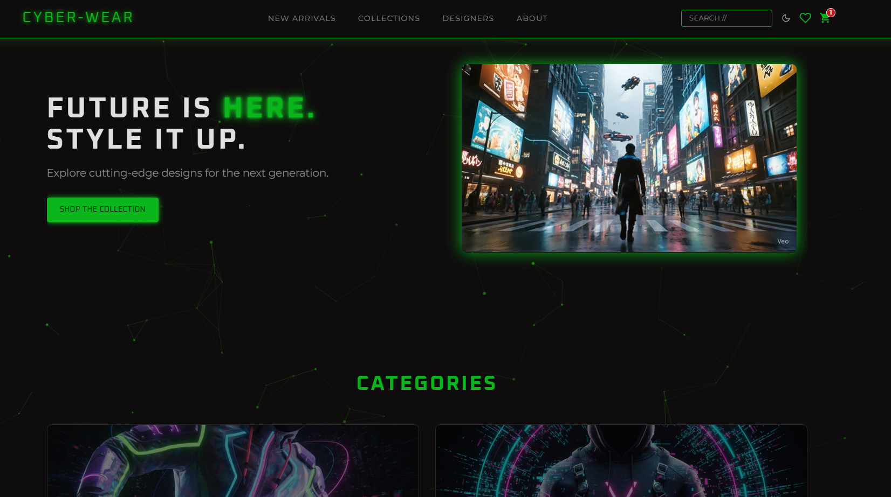
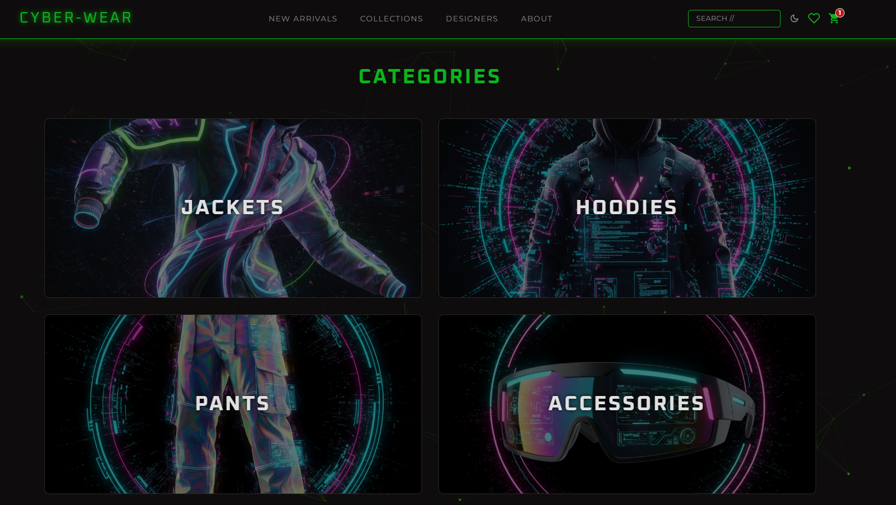
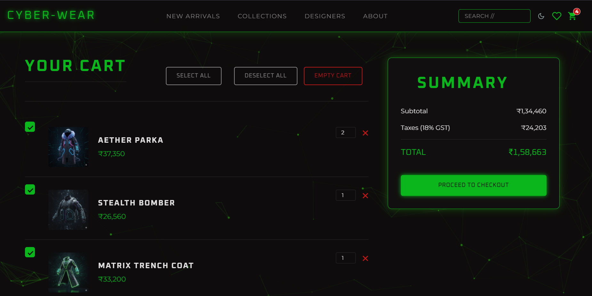

# CYBER-WEAR: A Futuristic E-Commerce Experience

Welcome to CYBER-WEAR, a fully-featured, front-end e-commerce website built from the ground up with a sleek, futuristic cyberpunk aesthetic. This project showcases a complete, interactive user journey from browsing products to a simulated checkout process, all built with vanilla HTML, CSS, and JavaScript.

**Live Demo:** [Link to deployed website]

---
## 📜 Project Description
CYBER-WEAR is a concept e-commerce platform designed for a futuristic clothing brand. The user interface is inspired by cyberpunk and high-tech themes, featuring a dark, neon-green color palette, glowing effects, and a dynamic, animated background. The project focuses on creating a seamless and engaging user experience while demonstrating core front-end development principles, including dynamic content rendering, state management with local storage, and a fully responsive design.

---
## ✨ Features

This project is packed with features that simulate a real-world e-commerce website:

* **Dynamic Product Catalog:** Products are loaded dynamically from a JavaScript data source on multiple pages, including the homepage, category pages, and search results.
* **Multi-Page Navigation:** A complete multi-page architecture with dedicated pages for:
    * Homepage with featured categories
    * Product Category Pages (Jackets, Hoodies, etc.)
    * Product Detail Pages with similar item recommendations
    * Full Collection Page
* **Interactive Search:** A fully functional search bar in the header that takes users to a dedicated search results page.
* **Shopping Cart:** A persistent shopping cart that uses `localStorage`. Users can:
    * Add items from any product grid or detail page.
    * View all items in a dedicated cart page.
    * Update item quantities.
    * Remove items individually.
    * Select/deselect items for purchase, with the total bill updating in real-time.
    * "Select All" and "Deselect All" for convenience.
    * "Empty Cart" with a confirmation prompt.
* **Wishlist:** A persistent wishlist that also uses `localStorage`, allowing users to save items for later and view them on a dedicated wishlist page.
* **Simulated Checkout Process:** A complete, multi-step checkout flow:
    * Users proceed from the cart to a checkout page.
    * The page includes a form with live validation for numeric-only fields.
    * A custom pop-up warns users if they try to leave the page accidentally.
    * Upon "payment," the cart is intelligently updated (only purchased items are removed), and the user is redirected to the homepage with a confirmation pop-up.
* **Newsletter Subscription:** A functional newsletter sign-up form in the footer that:
    * Uses **EmailJS** to send a styled, on-brand "Thank You" email to the new subscriber.
    * Provides instant on-page feedback, confirming the subscription.
* **Interactive UI & UX:**
    * **Theme Toggle:** A dark/light mode toggle with custom sun/moon icons that saves the user's preference.
    * **Animated Background:** A futuristic, interactive particle animation that appears on all pages.
    * **Pop-up Notifications:** A custom "Item added to cart!" pop-up provides immediate user feedback.
    * **"Pressed" Button Effect:** All major buttons have an active state that gives them a satisfying, tactile feel when clicked.

---
## 🛠️ Technologies Used

This project was built using core front-end technologies, with a focus on clean, vanilla code without reliance on external frameworks.
* **HTML5:** For the structure and semantics of the website.
* **CSS3:** For all styling, including:
    * **Flexbox** and **CSS Grid** for complex, responsive layouts.
    * **CSS Variables** for maintainable and themeable design.
    * **Animations and Transitions** for interactive effects.
    * **Pseudo-elements** for advanced UI enhancements.
* **JavaScript (ES6+):** For all dynamic functionality, including:
    * DOM manipulation to render products and update the UI.
    * Event handling for all interactive elements (buttons, search, forms).
    * State management using `localStorage` and `sessionStorage`.
    * Client-side form validation.
* **EmailJS:** A third-party service integrated to handle the sending of newsletter confirmation emails from the front-end.

---
## 🚀 Setup and Installation

To run this project locally, simply open the `index.html` file in your web browser. For the best experience (especially with features like the newsletter), it is recommended to use a simple local server.

1.  If you have VS Code, you can use the **Live Server** extension.
2.  Alternatively, with Python installed, you can run `python -m http.server` in the project's root directory.
3.  Navigate to `http://localhost:8000` (or the provided server address) in your browser.

---
## 🖼️ Screenshots

